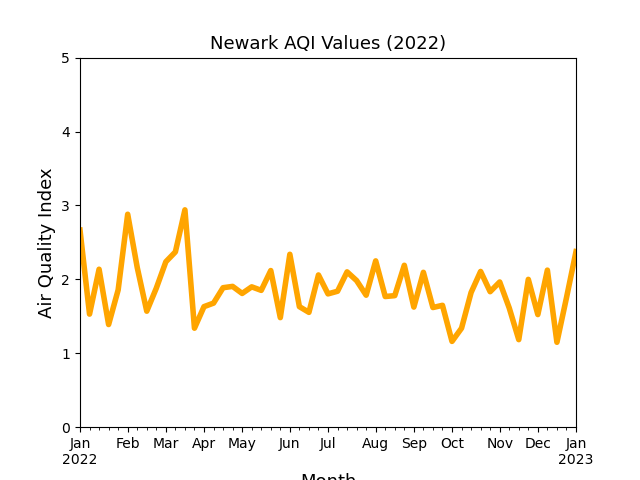

# Project Title
Analysis of Air Quality in 10 Major US Cities

## About
This project uses a large amount of air quality data and we have shown ten major cities and their air quality patterns. We have determined which cities are the "best" in terms of air quality and which are the "worst".
## Process
1) Data was gathered using openweathermap's API. Historic Air Quality Index(AQI) was gathered for 2021 and 2022, the only years currently available. 

2) Data was cleaned, organized and grouped by cities to be visualized into easy-to-understand bar graphs. Air quality can be summed up by 5 categories where 1 is the best air quality and 5 is the worst.

The number of days of each category was determined in a similar fashion as done by the Environmental Protection Agency(EPA). The worst air quality value for a given day is the assigned value for tht day.

3) Visualizations were created using Matplotlib and openstreetmap. A sample of each are below. In the map of the U.S, dot size indicated the number of days at each value and the color indicates the value. The color scale is the same as used by the EPA.

